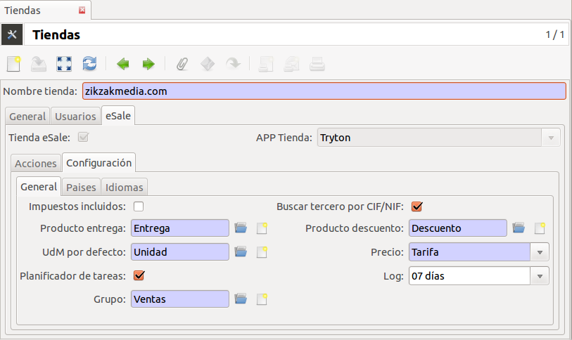

====================
Comercio electrónico
====================

**eSale** es el módulo base de cualquier herramienta de comercio electrónico.
En este módulo se definen las vistas y algunas acciones (botones) para la
importación de pedidos de terceras aplicaciones (Magento, Presta Shop, ...)

La gestión de las tiendas virtuales lo haremos mediante las Tiendas que permite a Tryton
definir y usar varias tiendas de la empresa. Antes de proceder el uso de la tienda 
de comercio electrónico consulte la documentación de roles y usuarios de multi tiendas.

.. inheritref:: esale/esale:section:configuracion

Configuración
-------------

La configuración de la tienda electrónica se realizará a través del menú 
|menu_sale_shop|.

.. |menu_sale_shop| tryref:: sale_shop.menu_sale_shop/complete_name

.. note:: Manualmente sólo podrá crear tiendas **Tryton eSale**. Para crear y
          activar tiendas externas tipo Magento, Prestashop, etc... consulte la
          documentación de cada módulo concreto
          (`Magento <../magento/index.html>`_).

Al establecer que una tienda esté disponible como canal de comercio
electrónico, aparecerá una nueva pestaña con la información/configuración. A
medida que vaya instalando módulos las opciones van incrementando en esta
sección.

* Acciones: Dispondrá de botones para la importación/exportación de datos
  de Tryton a la tienda electrónica

  * Pedidos
  
* Configuración: Configuración de la tienda

  * General: Configuraciones generales
  
    * Impuestos incluidos
    * Buscar tercero por CIF/NIF. Si el cliente está ya dado de alta en Tryton,
      no lo va a crear (busca por CIF/NIF)
    * Producto entrega
    * Producto descuento
    * Precio: Precio venta o por tarifa
    * Planificador de tareas. Los crons de esta tienda se activarán (importación
      pedidos, exportar stoc...)
    * Limpieza de logs: Días anterior de eliminación de los logs de los pedidos,
      productos,...

  * Países: Países que se permite la venta de esta tienda.
  * Idiomas: Idiomas que se dispone esta tienda y idioma por defecto

.. inheritref:: esale/esale:section:pedidos

Importar pedidos
----------------

Las tiendas **Tryton eSale** no necesitan descargar los pedidos ya
que se generan insitu en el mismo ERP. Para procesar los pedidos de
venta acceda a |menu_sale_form|.

.. |menu_sale_form| tryref:: sale.menu_sale_form/complete_name

.. inheritref:: esale/esale:section:stock

Exportar stock
--------------

TODO

.. inheritref:: esale/esale:section:product

Exportar products
-----------------

TODO

.. inheritref:: esale/esale:section:prices

Exportar precios
----------------

TODO
