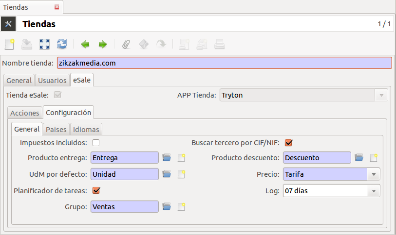

====================
Comercio electrónico
====================

**eSale** es el módulo base de cualquier herramienta de comercio electrónico.
En este módulo se definen las vistas y algunas acciones (botones) para la
importación de pedidos de terceras aplicaciones (Magento, Presta Shop, ...)

Este módulo nos instalará también el módulo `Sale Shop <../sale_shop/index.html>`_
que permite a Tryton definir y usar varias tiendas de la empresa. Antes de
proceder el uso de la tienda de comercio electrónico consulte la documentación
de roles y usuarios de multi tiendas.

La configuración de la tienda electrónica se realizará a través del menú 
|menu_sale_shop|\ .

.. |menu_sale_shop| tryref:: sale_shop.menu_sale_shop/complete_name

.. note:: Manualmente sólo podrá crear tiendas **Tryton eSale**. Para crear y
          activar tiendas externas tipo Magento, Prestashop, etc... consulte la
          documentación de cada módulo concreto
          (`Magento <../magento/index.html>`_).

Al establecer que una tienda esté disponible como canal de comercio
electrónico, aparecerá una nueva pestaña con la información/configuración. A
medida que vaya instalando módulos las opciones van incrementando en esta
sección.

* **Acciones**: Dispondrá de botones para la importación/exportación de datos
  de Tryton a la tienda electrónica
  * Pedidos
* **Configuración**: Configuración de la tienda
  * **General**:
   * Impuestos incluidos
   * Buscar tercero por CIF/NIF. Si el cliente está ya dado de alta en Tryton,
     no lo va a crear (busca por CIF/NIF)
   * Producto entrega
   * Producto descuento
   * Precio: Precio venta o por tarifa
   * Planificador de tareas. Los crons de esta tienda se activarán (importación
     pedidos, exportar stoc...)
   * Limpieza de logs: Días anterior de eliminación de los logs de los pedidos,
     productos,...
  * **Países**: Países que se permite la venta de esta tienda.
  * **Idiomas**: Idiomas que se dispone esta tienda y idioma por defecto

En el caso que disponga de una tienda **Tryton eSale** deberá instalar los
módulos `Producto eSale <../esale_product/index.html>`_ y
`Venta eSale <../esale_sale/index.html>`_ para la gestión de los productos y
configuración del servidor web.

.. note:: Las tiendas **Tryton eSale** no necesitan descargar los pedidos ya
          que se generan insitu en el mismo ERP. Para procesar los pedidos de
          venta acceda a |menu_sale_form|.

.. |menu_sale_form| tryref:: sale.act_sale_form/complete_name

